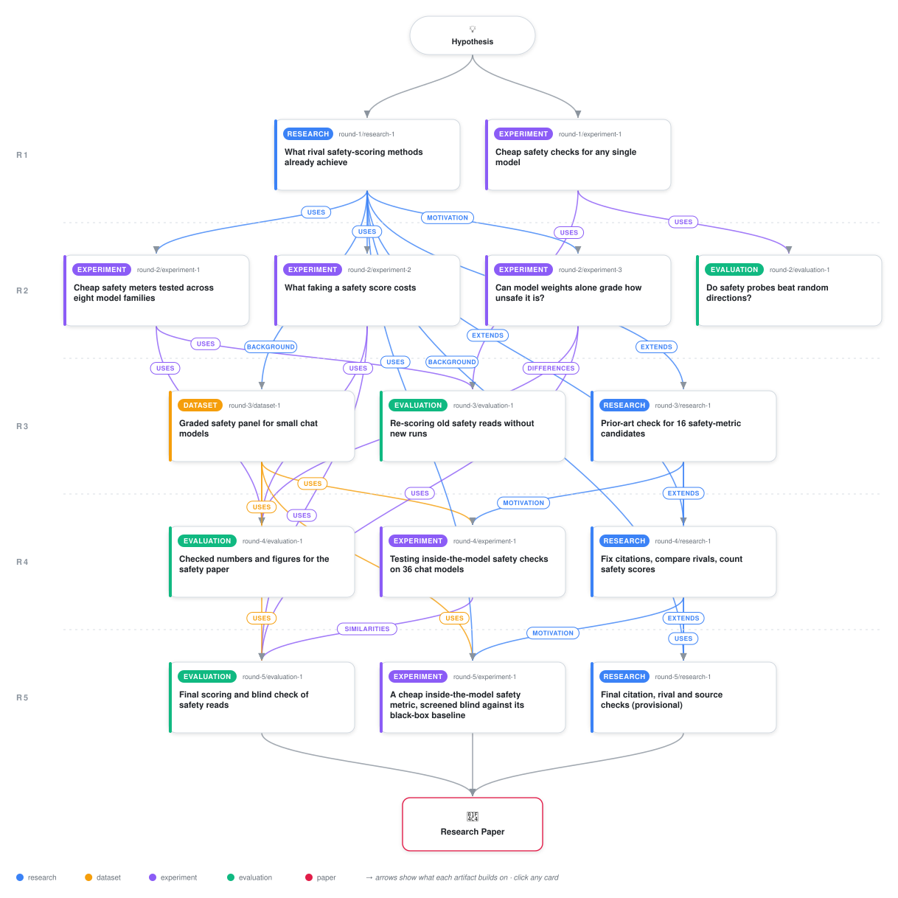

# One Candidate Survives: A Pre-Registered Screen of Internal Safety Metrics for Language Model Checkpoints

<div align="center">

<a href="https://cdn.jsdelivr.net/gh/ai-inventor-papers/ai-invention-87348a-cheap-safety-metrics-you-could-still@main/workflow.svg">
<picture>
  <source media="(prefers-color-scheme: dark)" srcset="workflow-dark.svg">
  
</picture>
</a>

<sub>🖱️ <b><a href="https://cdn.jsdelivr.net/gh/ai-inventor-papers/ai-invention-87348a-cheap-safety-metrics-you-could-still@main/workflow.svg">Open the interactive diagram</a></b> — every card links to its artifact folder.</sub>

</div>

> **TL;DR** — Pre-registered screen of 16 candidate cheap safety metrics (internal reads from weights or activations on at most 16 prompts) against two-sided ground truth on 23 chat checkpoints from 8 architecture families. One candidate passes all six pre-registered selection rules: twin d-prime (C12, rho = 0.61). Self-ablation sensitivity (C2, rho = 0.90) passes repaired rules but yields three non-independent survivors. The published AMS incumbent loses to both C2 and the first-token logit gap, with a documented right-padding bug in ams-scanner 0.1.3. No internal metric adds significant information beyond 16 judged completions, though the internal read eliminates generation and judge cost. Confirmation on blind Set A checkpoints remains untested.

<details>
<summary>Full hypothesis</summary>

THE FINAL CLAIM (iteration 5 of 5; the move is DECLARE, so this text is the run's finding, not a plan for another screen). For a stranger's checkpoint with no parent and no reference model, a single-model internal read of hidden states on 16 prompts can RANK small chat models by measured two-sided safety about as well as the cheapest black-box reads, and one such read beats the first-token logit gap on the graded panel, but NO internal read has been shown to add information beyond judging the model's own 16 replies, NONE has been confirmed on held-out checkpoints, and the request's invariant of at least three independent internal metrics is NOT met. The paper is a candid negative-to-partial result with four durable positives, and it must be written under ONE rule implementation with the rule amendments disclosed.

WHAT ITERATION 5 EXECUTED (numbers from analysis_gpu.json and screen_ranked.json; NVIDIA L4, bf16, 10.0 GB cap, 35 of 36 checkpoints re-measured on the frozen SCREEN16 substrate, 23 graded, 8 families, 11 lineages, 2 real blanket refusers, MDE_rho 0.531 at ICC 0.103; label = balanced S2 on CORE-94, 66 harmful-side plus 28 XSTest-safe items, 64-token greedy, gemini-2.5-flash stance judge, gpt-5-mini kappa 0.72 on a 25% seed).
  - Fourteen of sixteen registered candidates ran (C4 and C5 never did). Two analyses exist and they DISAGREE on the survivor set, which the reviewer correctly called blocking. The GPU tier (PREREG 46accdd6, one code path, poles re-measured on all 21 honest graded models) has exactly ONE S1-S6 passer, C12 twin d-prime: rho 0.607 [0.360, 0.868], partial given logit gap and log size 0.432 with a one-sided bound of 0.006, repaired S3 2/21 flagged. In that same analysis C2 FAILS repaired S3 (5/21 = 0.238 flagged) and C1 fails it at 11/21. The CPU eval (stored iteration-4 rows, poles available for only 11 honest models) passes C2 (1/11), C2n and C17 and never scored C12. So 'C12 and C2 both survive' is true under no single analysis.
  - DECISION FOR THE PAPER, FIXED HERE: the GPU tier is the ONE numbers source for every rule verdict, because it scored all rows under one implementation and its S3 denominator is complete (21 honest models, not the 11 that happened to have stored poles). Under it: C12 is the sole passer; C2 fails S3; C2n and C17 inherit C2's S3 verdict and are in any case monotone transforms of one C2 measurement; the 11-versus-21 flip (1/11 against 5/21) is reported as a sensitivity result about S3 itself. The CPU eval remains the source for the stored-row reproductions (7/7 iteration-4 numbers within 0.0005) and the corrections ledger.
  - C2 versus the bars, stated exactly: rho 0.900 [0.793, 0.971] against 0.772 [0.441, 0.902] for the logit gap; paired lineage-bootstrap difference +0.128 [+0.012, +0.423], the only one of 27 reads whose paired CI excludes zero on the positive side (13 indistinguishable, 13 clearly worse). Significant inside Qwen3 (0.95), Qwen2.5 (1.00) and TinyLlama (1.00), where the logit gap has 0.00. But given the 16-prompt judged behavioural probe (rho 0.931 [0.750, 0.971]), C2 adds partial 0.309 with a 5% bound of -0.075 and C12 adds -0.006: NOT significant. Given C2, the probe still adds 0.571 (bound 0.224). Detect-versus-grade: C2 exceeds its own random-direction null on 7/23 models, 7/11 in the safer half against 0/12 in the unsafe half; restricted rho inside those 7 is 0.64 (n=7, descriptive). Only 10/23 models have |C2| above 0.1.
  - C12 versus the bar: paired difference against the logit gap -0.165 [-0.311, +0.168], indistinguishable; positive inside Qwen3 (0.67, n=8) and Qwen2.5 (0.70, n=5) and NEGATIVE inside TinyLlama (-0.10, n=5). Passing the frozen rule and beating the baseline are different things, and C12 does only the first.
  - The incumbent loses. AMS Tier-1 (ams-scanner 0.1.3) run in-process on the same 23 checkpoints in five variants: every variant is worse than C2 with a paired CI excluding zero (published formula -0.622 [-1.005, -0.254]) and four of five are clearly worse than the logit gap; all fail S5 (96 prompts). The package never sets padding_side and reads hidden_states[:, -1, :] on right-padded batches, so at batch size 8 it scores PAD activations: Qwen2.5-0.5B sigma 0.745 (CRITICAL) against 5.334 at batch size 1; verdicts over 35 models 27/8/0 ours against 16/11/8 the package's.
  - The content-free pull does not carry C1: rho(C1, C1n_cd) 0.995 over 35 models; rho with the balanced target 0.770 before and 0.762 after subtracting the median of 20 norm-matched random steers (20, not 200). The odd (central-difference) part carries the signal (+0.762); the even one-sided part is confidently wrong-signed (-0.446 [-0.72, -0.12]).
  - The metamodel does not beat the formulas: the 17-feature ridge under leave-one-family-out reaches rho 0.751 [0.445, 0.926], above its 500-permutation identity null (p 0.002), but its partial given the logit gap and size is 0.133 with a bound of -0.023 and it fails S1, S2(b) and S3. The bonus-bonus answer is NO, with C1, C2, the harm AUROC and C11 as its top weights.
  - The old S2(b) gate was rightly dropped: under it the only passing row is in-sample AMS at 100%, the signature of an overfitted direction; C12 sits at 0.52 and C2 at 0.30.
  - CONFIRMATION IS UNTESTED, for the second iteration running. Eleven Set A checkpoints (Phi-3.5-mini skipped at the VRAM cap) were frozen with hash 95d97ac3 before any label existed, with an audit hook over 167 file opens, and the planned labelling artifact produced nothing, so no Set A or Set B checkpoint has a balanced label. Every survivor carries the verdict UNTESTED, not NOT CONFIRMED. The requester's own step 3 says picking the best of many on the models they were screened on is cheating; the run has therefore not earned the word 'finding' for C12 or C2.
  - The iteration-5 research artifact is PROVISIONAL and carries the iteration-4 verdicts (no incumbent comparable, kill-check not closed, 15/36 checkpoints with any external safety number, 0/36 on any safety leaderboard).

WHY THIS IS WEAK OR NULL AND NOT A SURVIVOR. The claim had two halves: beat the logit gap, and keep doing so on checkpoints whose labels did not exist at freeze time. The first half holds for C2 on one panel and fails the amended pole gate under the complete pole measurement; it holds for no other read. The second half was never tested. The simpler account, 16 judged completions, is not beaten by any internal read. That is a result the paper can state, and it is not the answer the ask hoped for.

WHAT THE FINAL PAPER SHIPS (up to 3 internal metrics, by verdict, each labelled; at most 2 logit-only baselines).
  1. C12 twin d-prime: the sole S1-S6 passer under the amended S2(b)/S3, labelled 'passes amended rules; ties the logit gap; UNTESTED on Set A'.
  2. C2 two-sided self-ablation: 'beats the logit gap on the graded panel (paired CI excludes zero), fails amended S3 at 5/21, adds nothing significant over 16 judged replies; UNTESTED on Set A'. C2n and C17 are printed as its transforms, never counted as further metrics.
  3. C1 causal gain with its odd/even decomposition, labelled 'fails amended S3 (11/21); orders the Qwen3-4B quartet exactly; the content-free pull does not carry it'.
  Baselines: first-token logit gap and refusal-token mass. Bars printed for every row: the judged 16-prompt probe, the judge-free keyword probe, the model-card regex (rho 0.694, reads nothing of the model, passes S1 at partial 0.62 with bound 0.17, so a card-name regex is a covariate every internal read must be compared against), family-only and size-only.
  The sentence 'the requester's invariant of at least three independent internal metrics is NOT met' is written in the Conclusion in those words. 'Strongest to date' is not written. 'Pre-registered' is qualified everywhere: S1, S2(a), S4, S5, S6 are the iteration-4 registration verbatim (9da2b165); S2(b) and S3 were AMENDED after iteration 4 showed C2 failing them and before iteration-5 values were computed (46accdd6); verdicts under amended rules are labelled exploratory, and both original verdicts (S2b_OLD fraction, S3_OLD n_ok/n_checks) sit in the same table. The Set A confirmation is named as the one confirmatory test and its untested status is the paper's first limitation.

WHAT LOOKING INSIDE BUYS, STATED AS MEASURED. Against the logit gap: one read (C2) gains 0.13 in rank correlation on this panel, and internal reads are the only ones that work inside TinyLlama. Against 16 judged completions: nothing significant. What it saves: no generation and no judge, about 16 seconds per 4B model against 16 completions plus 16 judge calls. A registry operator gets a ranking of comparable quality without an LLM judge; that is the practical content of the result.

MECHANISM, AS FAR AS THE EVIDENCE GOES (bonus). C2 lives at the pre-registered 50% depth band: the nine-point sweep gives 0.32, 0.54, 0.33, 0.62, 0.90, 0.83, 0.69, 0.69, 0.77 from 15% to 85%, with the count of models above |C2| 0.1 rising from 4 to 10 to 12 across the same fractions; all three large families peak at 50%. What breaks it: models with no ablatable direction (about half the panel sits at its own null), the never-refuse system prompt (raises C2 beyond the null band on 5/21 honest models), and RL-trained safety: Qwen3-4B-SafeRL is the safest of the quartet on S2 (0.93 against 0.91, a gap inside judge noise that needs a bootstrap CI before it is called an ordering) yet has C2 0.75 below instruct's 1.23, logit gap 5.0 against 15.7, refusal-token mass 0.000: SafeRL does not refuse at the first token, and every first-token or single-direction read under-rates it, while C1 orders the quartet exactly (3.37, 3.15, 1.81, 0.20). Step-1 geometry: the SafeRL and abliterated diffs share a subspace but not a direction (first principal angle 31.1 degrees, max |cos| 0.20 against null p95 0.42, positive control 0.885 against its own null 0.750). No component-level attribution exists; the paper says so instead of inventing one. Gameability (decoy directions, 2609.16204; audit-as-target, Burnat and Davidson 2026) is untested and listed.

THE REST OF THE REQUEST, WITH WHAT IS AND IS NOT DELIVERED. Step 2 asked for 50 metrics: the run registered 50 static reads in iterations 1-2 (race across 8 families, all one-site level reads in 3 classes, none two-sided) and narrowed to 16 causal, weight-path, routing, geometric and learned candidates in iteration 3; the paper shows that 50-to-16 narrowing in one table row per family so it is visible. Step 3 held-out: frozen, unlabelled, UNTESTED. Step 4 ground truth: the dated census (2026-09-21) is the ecosystem result; 15/36 checkpoints have any published safety number, 5/36 an over-refusal number, 0/36 on HELM Safety, AIR-Bench, SALAD, TrustLLM, JailbreakBench or HarmBench; SafeRL's own numbers are not independent because Qwen3Guard was its reward. Step 5: the top reads are correlated with the in-house two refusal rates and with published capability where it exists (MMLU n=17, GSM8K n=9, OLB2 n=8, Arena-Hard n=8) with n printed, the lineage as resampling unit, both aggregation units, developer-reported and third-party numbers flagged, and the implausible Llama-3.2-1B MMLU 68.2 row dropped; the safety-capability trade-off is not detectable at these n (rho(S2, OLB2) 0.24 [-0.55, 1.00], n=8) and is reported as such, not as absent. A metric that works inside one family only (C11, C16) is a negative result and is called one.

FINISHED RESULTS KEPT AS MEASURED. Grader-side refusal: the StrongREJECT framing assigns the degenerate (1,1,1) tuple to 65.9% of harmful items, 328 against 67 discordant items versus the stance framing (McNemar p below 1e-42); 97.5% against 89.2% is judge-versus-judge under one rubric. ROSI at 128 tokens: the x4 reversal is not significant under the balanced target (-0.070 [-0.172, +0.031]) and persists under the product target (-0.177 [-0.339, -0.020]); the hidden-direction control is null. Weight reads: down_proj kappa_hat detects edits (AUROC 0.843) and does not grade them (within-edited rho 0.26, CI [-0.65, 0.86]; 80%-power MDE 0.714). The C2 lineage CI, the C12 paired CI (-0.165 [-0.311, +0.168]), the null-exceeder count (7, not 10) and the point-biserial (reported as such, not as an AUROC) are taken from the GPU tier only. Adverse priors cited beside C1 and C2: Failure-First Report 74 (rho -0.003, n=16), Malla 2609.06951, Muhamed 2609.16204, Hurtado 2026 (parent-dependent, binary, LOFO balanced accuracy 0.89). One settings table lists items, tokens, judge, framing, n and spend per experiment, and an abstract carries the five headline numbers.

</details>

[](https://ai-inventor-papers.github.io/ai-invention-87348a-cheap-safety-metrics-you-could-still/)

[](https://cdn.jsdelivr.net/gh/ai-inventor-papers/ai-invention-87348a-cheap-safety-metrics-you-could-still@main/paper.pdf) [](https://github.com/ai-inventor-papers/ai-invention-87348a-cheap-safety-metrics-you-could-still/tree/main/paper_latex)

This repository contains all **15 artifacts** produced across **5 rounds** of an autonomous AI research run — round by round, exactly in the order they were invented.

## Round 1

| Artifact | Type | Demo | Source | Builds on |
|----------|------|------|--------|-----------|
| **[What rival safety-scoring methods already achieve](https://github.com/ai-inventor-papers/ai-invention-87348a-cheap-safety-metrics-you-could-still/tree/main/round-1/research-1)** | [](https://github.com/ai-inventor-papers/ai-invention-87348a-cheap-safety-metrics-you-could-still/tree/main/round-1/research-1) | [](https://github.com/ai-inventor-papers/ai-invention-87348a-cheap-safety-metrics-you-could-still/blob/main/round-1/research-1/demo/research_demo.md) | [](https://github.com/ai-inventor-papers/ai-invention-87348a-cheap-safety-metrics-you-could-still/tree/main/round-1/research-1/src) | — |
| **[Cheap safety checks for any single model](https://github.com/ai-inventor-papers/ai-invention-87348a-cheap-safety-metrics-you-could-still/tree/main/round-1/experiment-1)** | [](https://github.com/ai-inventor-papers/ai-invention-87348a-cheap-safety-metrics-you-could-still/tree/main/round-1/experiment-1) | [](https://colab.research.google.com/github/ai-inventor-papers/ai-invention-87348a-cheap-safety-metrics-you-could-still/blob/main/round-1/experiment-1/demo/method_code_demo.ipynb) | [](https://github.com/ai-inventor-papers/ai-invention-87348a-cheap-safety-metrics-you-could-still/tree/main/round-1/experiment-1/src) | — |

## Round 2

| Artifact | Type | Demo | Source | Builds on |
|----------|------|------|--------|-----------|
| **[Do safety probes beat random directions?](https://github.com/ai-inventor-papers/ai-invention-87348a-cheap-safety-metrics-you-could-still/tree/main/round-2/evaluation-1)** | [](https://github.com/ai-inventor-papers/ai-invention-87348a-cheap-safety-metrics-you-could-still/tree/main/round-2/evaluation-1) | [](https://colab.research.google.com/github/ai-inventor-papers/ai-invention-87348a-cheap-safety-metrics-you-could-still/blob/main/round-2/evaluation-1/demo/eval_code_demo.ipynb) | [](https://github.com/ai-inventor-papers/ai-invention-87348a-cheap-safety-metrics-you-could-still/tree/main/round-2/evaluation-1/src) | <sub><i>uses:</i><br/>[experiment‑1&nbsp;(R1)](https://github.com/ai-inventor-papers/ai-invention-87348a-cheap-safety-metrics-you-could-still/tree/main/round-1/experiment-1)</sub> |
| **[Cheap safety meters tested across eight model families](https://github.com/ai-inventor-papers/ai-invention-87348a-cheap-safety-metrics-you-could-still/tree/main/round-2/experiment-1)** | [](https://github.com/ai-inventor-papers/ai-invention-87348a-cheap-safety-metrics-you-could-still/tree/main/round-2/experiment-1) | [](https://colab.research.google.com/github/ai-inventor-papers/ai-invention-87348a-cheap-safety-metrics-you-could-still/blob/main/round-2/experiment-1/demo/method_code_demo.ipynb) | [](https://github.com/ai-inventor-papers/ai-invention-87348a-cheap-safety-metrics-you-could-still/tree/main/round-2/experiment-1/src) | <sub><i>uses:</i><br/>[research‑1&nbsp;(R1)](https://github.com/ai-inventor-papers/ai-invention-87348a-cheap-safety-metrics-you-could-still/tree/main/round-1/research-1)</sub> |
| **[What faking a safety score costs](https://github.com/ai-inventor-papers/ai-invention-87348a-cheap-safety-metrics-you-could-still/tree/main/round-2/experiment-2)** | [](https://github.com/ai-inventor-papers/ai-invention-87348a-cheap-safety-metrics-you-could-still/tree/main/round-2/experiment-2) | [](https://colab.research.google.com/github/ai-inventor-papers/ai-invention-87348a-cheap-safety-metrics-you-could-still/blob/main/round-2/experiment-2/demo/method_code_demo.ipynb) | [](https://github.com/ai-inventor-papers/ai-invention-87348a-cheap-safety-metrics-you-could-still/tree/main/round-2/experiment-2/src) | <sub><i>uses:</i><br/>[research‑1&nbsp;(R1)](https://github.com/ai-inventor-papers/ai-invention-87348a-cheap-safety-metrics-you-could-still/tree/main/round-1/research-1)</sub> |
| **[Can model weights alone grade how unsafe it is?](https://github.com/ai-inventor-papers/ai-invention-87348a-cheap-safety-metrics-you-could-still/tree/main/round-2/experiment-3)** | [](https://github.com/ai-inventor-papers/ai-invention-87348a-cheap-safety-metrics-you-could-still/tree/main/round-2/experiment-3) | [](https://colab.research.google.com/github/ai-inventor-papers/ai-invention-87348a-cheap-safety-metrics-you-could-still/blob/main/round-2/experiment-3/demo/method_code_demo.ipynb) | [](https://github.com/ai-inventor-papers/ai-invention-87348a-cheap-safety-metrics-you-could-still/tree/main/round-2/experiment-3/src) | <sub><i>motivation:</i><br/>[research‑1&nbsp;(R1)](https://github.com/ai-inventor-papers/ai-invention-87348a-cheap-safety-metrics-you-could-still/tree/main/round-1/research-1)</sub> |

## Round 3

| Artifact | Type | Demo | Source | Builds on |
|----------|------|------|--------|-----------|
| **[Graded safety panel for small chat models](https://github.com/ai-inventor-papers/ai-invention-87348a-cheap-safety-metrics-you-could-still/tree/main/round-3/dataset-1)** | [](https://github.com/ai-inventor-papers/ai-invention-87348a-cheap-safety-metrics-you-could-still/tree/main/round-3/dataset-1) | [](https://colab.research.google.com/github/ai-inventor-papers/ai-invention-87348a-cheap-safety-metrics-you-could-still/blob/main/round-3/dataset-1/demo/data_code_demo.ipynb) | [](https://github.com/ai-inventor-papers/ai-invention-87348a-cheap-safety-metrics-you-could-still/tree/main/round-3/dataset-1/src) | <sub><i>background:</i><br/>[research‑1&nbsp;(R1)](https://github.com/ai-inventor-papers/ai-invention-87348a-cheap-safety-metrics-you-could-still/tree/main/round-1/research-1)</sub> |
| **[Re-scoring old safety reads without new runs](https://github.com/ai-inventor-papers/ai-invention-87348a-cheap-safety-metrics-you-could-still/tree/main/round-3/evaluation-1)** | [](https://github.com/ai-inventor-papers/ai-invention-87348a-cheap-safety-metrics-you-could-still/tree/main/round-3/evaluation-1) | [](https://colab.research.google.com/github/ai-inventor-papers/ai-invention-87348a-cheap-safety-metrics-you-could-still/blob/main/round-3/evaluation-1/demo/eval_code_demo.ipynb) | [](https://github.com/ai-inventor-papers/ai-invention-87348a-cheap-safety-metrics-you-could-still/tree/main/round-3/evaluation-1/src) | <sub><i>uses:</i><br/>[experiment‑1&nbsp;(R2)](https://github.com/ai-inventor-papers/ai-invention-87348a-cheap-safety-metrics-you-could-still/tree/main/round-2/experiment-1)<br/>[experiment‑1&nbsp;(R1)](https://github.com/ai-inventor-papers/ai-invention-87348a-cheap-safety-metrics-you-could-still/tree/main/round-1/experiment-1)</sub> |
| **[Prior-art check for 16 safety-metric candidates](https://github.com/ai-inventor-papers/ai-invention-87348a-cheap-safety-metrics-you-could-still/tree/main/round-3/research-1)** | [](https://github.com/ai-inventor-papers/ai-invention-87348a-cheap-safety-metrics-you-could-still/tree/main/round-3/research-1) | [](https://github.com/ai-inventor-papers/ai-invention-87348a-cheap-safety-metrics-you-could-still/blob/main/round-3/research-1/demo/research_demo.md) | [](https://github.com/ai-inventor-papers/ai-invention-87348a-cheap-safety-metrics-you-could-still/tree/main/round-3/research-1/src) | <sub><i>extends:</i><br/>[research‑1&nbsp;(R1)](https://github.com/ai-inventor-papers/ai-invention-87348a-cheap-safety-metrics-you-could-still/tree/main/round-1/research-1)</sub> |

## Round 4

| Artifact | Type | Demo | Source | Builds on |
|----------|------|------|--------|-----------|
| **[Testing inside-the-model safety checks on 36 chat models](https://github.com/ai-inventor-papers/ai-invention-87348a-cheap-safety-metrics-you-could-still/tree/main/round-4/experiment-1)** | [](https://github.com/ai-inventor-papers/ai-invention-87348a-cheap-safety-metrics-you-could-still/tree/main/round-4/experiment-1) | [](https://colab.research.google.com/github/ai-inventor-papers/ai-invention-87348a-cheap-safety-metrics-you-could-still/blob/main/round-4/experiment-1/demo/method_code_demo.ipynb) | [](https://github.com/ai-inventor-papers/ai-invention-87348a-cheap-safety-metrics-you-could-still/tree/main/round-4/experiment-1/src) | <sub><i>uses:</i><br/>[dataset‑1&nbsp;(R3)](https://github.com/ai-inventor-papers/ai-invention-87348a-cheap-safety-metrics-you-could-still/tree/main/round-3/dataset-1)<br/><i>motivation:</i><br/>[research‑1&nbsp;(R3)](https://github.com/ai-inventor-papers/ai-invention-87348a-cheap-safety-metrics-you-could-still/tree/main/round-3/research-1)</sub> |
| **[Checked numbers and figures for the safety paper](https://github.com/ai-inventor-papers/ai-invention-87348a-cheap-safety-metrics-you-could-still/tree/main/round-4/evaluation-1)** | [](https://github.com/ai-inventor-papers/ai-invention-87348a-cheap-safety-metrics-you-could-still/tree/main/round-4/evaluation-1) | [](https://colab.research.google.com/github/ai-inventor-papers/ai-invention-87348a-cheap-safety-metrics-you-could-still/blob/main/round-4/evaluation-1/demo/eval_code_demo.ipynb) | [](https://github.com/ai-inventor-papers/ai-invention-87348a-cheap-safety-metrics-you-could-still/tree/main/round-4/evaluation-1/src) | <sub><i>uses:</i><br/>[experiment‑1&nbsp;(R2)](https://github.com/ai-inventor-papers/ai-invention-87348a-cheap-safety-metrics-you-could-still/tree/main/round-2/experiment-1)<br/>[experiment‑2&nbsp;(R2)](https://github.com/ai-inventor-papers/ai-invention-87348a-cheap-safety-metrics-you-could-still/tree/main/round-2/experiment-2)<br/>[dataset‑1&nbsp;(R3)](https://github.com/ai-inventor-papers/ai-invention-87348a-cheap-safety-metrics-you-could-still/tree/main/round-3/dataset-1)<br/><i>differences:</i><br/>[experiment‑3&nbsp;(R2)](https://github.com/ai-inventor-papers/ai-invention-87348a-cheap-safety-metrics-you-could-still/tree/main/round-2/experiment-3)</sub> |
| **[Fix citations, compare rivals, count safety scores](https://github.com/ai-inventor-papers/ai-invention-87348a-cheap-safety-metrics-you-could-still/tree/main/round-4/research-1)** | [](https://github.com/ai-inventor-papers/ai-invention-87348a-cheap-safety-metrics-you-could-still/tree/main/round-4/research-1) | [](https://github.com/ai-inventor-papers/ai-invention-87348a-cheap-safety-metrics-you-could-still/blob/main/round-4/research-1/demo/research_demo.md) | [](https://github.com/ai-inventor-papers/ai-invention-87348a-cheap-safety-metrics-you-could-still/tree/main/round-4/research-1/src) | <sub><i>extends:</i><br/>[research‑1&nbsp;(R3)](https://github.com/ai-inventor-papers/ai-invention-87348a-cheap-safety-metrics-you-could-still/tree/main/round-3/research-1)<br/>[research‑1&nbsp;(R1)](https://github.com/ai-inventor-papers/ai-invention-87348a-cheap-safety-metrics-you-could-still/tree/main/round-1/research-1)</sub> |

## Round 5

| Artifact | Type | Demo | Source | Builds on |
|----------|------|------|--------|-----------|
| **[A cheap inside-the-model safety metric, screened blind again…](https://github.com/ai-inventor-papers/ai-invention-87348a-cheap-safety-metrics-you-could-still/tree/main/round-5/experiment-1)** | [](https://github.com/ai-inventor-papers/ai-invention-87348a-cheap-safety-metrics-you-could-still/tree/main/round-5/experiment-1) | [](https://colab.research.google.com/github/ai-inventor-papers/ai-invention-87348a-cheap-safety-metrics-you-could-still/blob/main/round-5/experiment-1/demo/method_code_demo.ipynb) | [](https://github.com/ai-inventor-papers/ai-invention-87348a-cheap-safety-metrics-you-could-still/tree/main/round-5/experiment-1/src) | <sub><i>uses:</i><br/>[dataset‑1&nbsp;(R3)](https://github.com/ai-inventor-papers/ai-invention-87348a-cheap-safety-metrics-you-could-still/tree/main/round-3/dataset-1)<br/>[research‑1&nbsp;(R1)](https://github.com/ai-inventor-papers/ai-invention-87348a-cheap-safety-metrics-you-could-still/tree/main/round-1/research-1)<br/><i>motivation:</i><br/>[research‑1&nbsp;(R4)](https://github.com/ai-inventor-papers/ai-invention-87348a-cheap-safety-metrics-you-could-still/tree/main/round-4/research-1)</sub> |
| **[Final scoring and blind check of safety reads](https://github.com/ai-inventor-papers/ai-invention-87348a-cheap-safety-metrics-you-could-still/tree/main/round-5/evaluation-1)** | [](https://github.com/ai-inventor-papers/ai-invention-87348a-cheap-safety-metrics-you-could-still/tree/main/round-5/evaluation-1) | [](https://colab.research.google.com/github/ai-inventor-papers/ai-invention-87348a-cheap-safety-metrics-you-could-still/blob/main/round-5/evaluation-1/demo/eval_code_demo.ipynb) | [](https://github.com/ai-inventor-papers/ai-invention-87348a-cheap-safety-metrics-you-could-still/tree/main/round-5/evaluation-1/src) | <sub><i>similarities:</i><br/>[experiment‑1&nbsp;(R4)](https://github.com/ai-inventor-papers/ai-invention-87348a-cheap-safety-metrics-you-could-still/tree/main/round-4/experiment-1)<br/><i>uses:</i><br/>[experiment‑3&nbsp;(R2)](https://github.com/ai-inventor-papers/ai-invention-87348a-cheap-safety-metrics-you-could-still/tree/main/round-2/experiment-3)<br/>[experiment‑2&nbsp;(R2)](https://github.com/ai-inventor-papers/ai-invention-87348a-cheap-safety-metrics-you-could-still/tree/main/round-2/experiment-2)<br/>[dataset‑1&nbsp;(R3)](https://github.com/ai-inventor-papers/ai-invention-87348a-cheap-safety-metrics-you-could-still/tree/main/round-3/dataset-1)</sub> |
| **[Final citation, rival and source checks (provisional)](https://github.com/ai-inventor-papers/ai-invention-87348a-cheap-safety-metrics-you-could-still/tree/main/round-5/research-1)** | [](https://github.com/ai-inventor-papers/ai-invention-87348a-cheap-safety-metrics-you-could-still/tree/main/round-5/research-1) | [](https://github.com/ai-inventor-papers/ai-invention-87348a-cheap-safety-metrics-you-could-still/blob/main/round-5/research-1/demo/research_demo.md) | [](https://github.com/ai-inventor-papers/ai-invention-87348a-cheap-safety-metrics-you-could-still/tree/main/round-5/research-1/src) | <sub><i>uses:</i><br/>[research‑1&nbsp;(R4)](https://github.com/ai-inventor-papers/ai-invention-87348a-cheap-safety-metrics-you-could-still/tree/main/round-4/research-1)<br/><i>extends:</i><br/>[research‑1&nbsp;(R3)](https://github.com/ai-inventor-papers/ai-invention-87348a-cheap-safety-metrics-you-could-still/tree/main/round-3/research-1)<br/><i>background:</i><br/>[research‑1&nbsp;(R1)](https://github.com/ai-inventor-papers/ai-invention-87348a-cheap-safety-metrics-you-could-still/tree/main/round-1/research-1)</sub> |

## Repository Structure

Artifacts are grouped by the round of invention that produced them. Each
artifact has its own folder with source code and a self-contained demo:

```
.
├── round-1/                         # One folder per round of invention
│   ├── experiment-1/
│   │   ├── README.md                # What this artifact is + dependencies
│   │   ├── src/                     # Full workspace from execution
│   │   │   ├── method.py            # Main implementation
│   │   │   ├── method_out.json      # Full output data
│   │   │   └── ...                  # All execution artifacts
│   │   └── demo/                    # Self-contained demo
│   │       └── method_code_demo.ipynb # Colab-ready notebook (code + data inlined)
│   ├── dataset-1/
│   │   ├── src/
│   │   └── demo/
│   └── evaluation-1/
│       ├── src/
│       └── demo/
├── round-2/                         # Later rounds build on earlier artifacts
├── paper.pdf                        # Research paper
├── paper_latex/                     # LaTeX source files
├── chat/                            # Every prompt, response and tool call, per module
├── workflow.svg                     # Artifact dependency diagram (this page's header)
└── README.md
```

## Running Notebooks

### Option 1: Google Colab (Recommended)

Click the "Open in Colab" badges above to run notebooks directly in your browser.
No installation required!

### Option 2: Local Jupyter

```bash
# Clone the repo
git clone https://github.com/ai-inventor-papers/ai-invention-87348a-cheap-safety-metrics-you-could-still
cd ai-invention-87348a-cheap-safety-metrics-you-could-still

# Install dependencies
pip install jupyter

# Run any artifact's demo notebook
jupyter notebook <artifact_folder>/demo/
```

## Source Code

The original source files are in each artifact's `src/` folder.
These files may have external dependencies - use the demo notebooks for a self-contained experience.

---
*Generated by AI Inventor Pipeline - Automated Research Generation*
