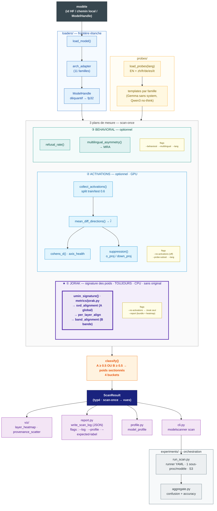

# Pipeline — Model Scanner

Détecteur **reference-free** d'abliteration de LLM : à partir d'un modèle seul (sans
l'original), décider s'il a été **abliteré** (censure retirée par ablation
directionnelle), simplement **censuré**, **fine-tuné-décensuré**, ou **ambigu**.

Le cœur du détecteur est la technique **Jorak** : la signature spectrale des
**poids**, reference-free, sur CPU, sans modèle original — c'est elle qu'on
exploite et qu'on met en avant. Deux plans la complètent : **ACTIVATIONS**
(l'axe de refus est-il vivant ?) et **BEHAVIORAL** (boîte noire, génération).

Principe d'architecture : **frontière étanche** (`loaders/` ne dit jamais à
`metrics/` d'où vient le modèle) + **scan-once** (un seul forward coûteux → un
`ScanResult` typé → toutes les vues sont des projections, jamais des recalculs).

---

## Vue d'ensemble



---

## Les 3 plans de mesure

| Plan | Module | Coût | Signal produit | Flags | Rôle |
|------|--------|------|----------------|-------|------|
| **★ JORAK** (poids) | `metrics/jorak.py` | CPU, sans sonde, sans original, scale aux gros modèles | `svd_alignment` (A global), `per_layer_align`, `band_alignment` (B bande) | toujours actif · `--no-activations` (Jorak seul) · `--report` (bundle + heatmap) | **Smoking-gun reference-free** : poids sectionnés ? |
| **ACTIVATIONS** | `activations/` + `directions/` + `metrics/axis_health.py` | GPU (forward), optionnel | `r̂` (mean-diff), `cohens_d` (santé d'axe), `suppression` | `--no-activations` (off) · `--probe-subset` · `--lang` | L'axe de refus est-il vivant ? |
| **BEHAVIORAL** | `metrics/behavioral.py` | génération, optionnel | `refusal_rate`, asymétrie multilingue `MRA` | `--behavioral` · `--multilingual` · `--lang` | Sépare CENSORED vs FINETUNED (obligatoire pour ce bucket) |

**Jorak** tourne toujours et suffit à trancher CENSORED/ABLATED : c'est la technique
à exploiter (pas de GPU, pas de modèle original, passe à l'échelle). Avec
`--no-activations` elle devient le **seul** signal reference-free — profil T4-safe / gros modèles.
Le plan **ACTIVATIONS** confirme que l'axe est intact (une ablation le préserve).
Le plan **BEHAVIORAL** est le **seul** à distinguer un modèle simplement
fine-tuné-décensuré d'un censuré (poids intacts + axe vivant dans les deux cas).

---

## Les 4 buckets en sortie de `classify()`

```
                 | modèle refuse        | modèle obéit
    axe vivant   | CENSORED             | ABLATED  (axe intact MAIS débranché)
    axe dégradé  | AMBIGUOUS (partiel)  | FINETUNED_DECENSORED (axe dissous)
```

**Règle de décision** (`classifier/scanner.py`) — pilotée par **Jorak** :
`write_severed = svd_alignment ≥ 0.5  OU  band_alignment ≥ 0.5  OU  suppression ≤ 1e-2`

- `write_severed` **et** axe vivant → **ABLATED** (la cible).
- poids intacts → le plan BEHAVIORAL tranche : refuse → **CENSORED**, obéit → **FINETUNED_DECENSORED**.
- la **bande B** (Jorak) rattrape l'ablation localisée (ex. Heretic, couches profondes 19-22) que le global A rate.

---

## Chemin critique (une ligne)

```
load_model → collect_activations → mean_diff_directions → metrics → classify → ScanResult → viz/report
```

Le plan **Jorak** (`umin_signature`) court en parallèle, sans sonde ni GPU ; c'est lui le smoking-gun reference-free.

---

## Orchestration & livrables

| Étage | Fichier | Sortie |
|-------|---------|--------|
| Scan d'un modèle (debug) | `experiments/scan_matrix.py` | `scans/<model>.npz` + `logs/<model>.json` |
| Runner batch (YAML, AWS) | `experiments/run_scan.py` | 1 JSON/modèle poussé sur S3, reprise idempotente |
| Moulinette | `experiments/aggregate.py` | table predicted/expected + matrice de confusion + accuracy |
| CLI | `modelscanner/cli.py` | `modelscanner scan <model> [flags]` |
